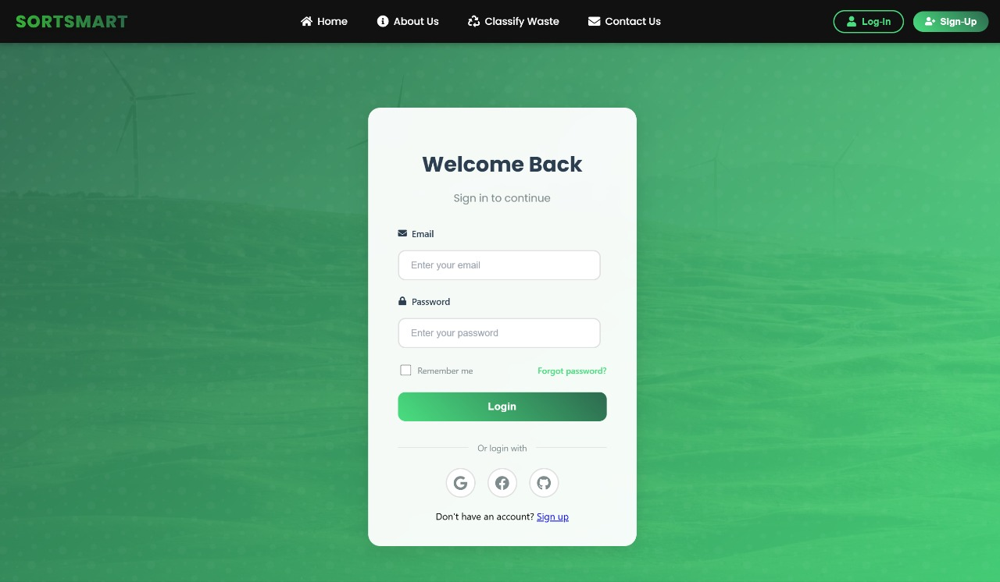
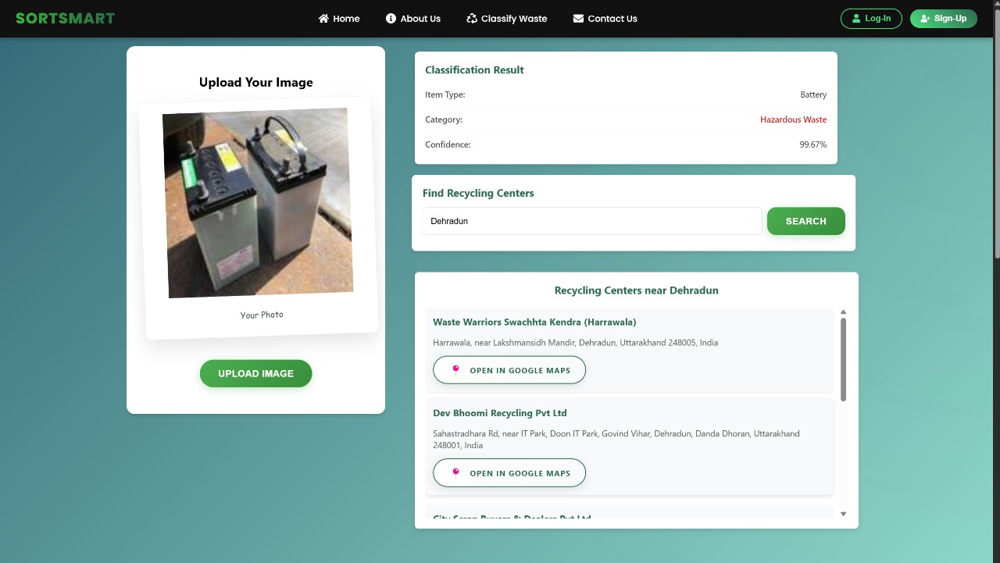
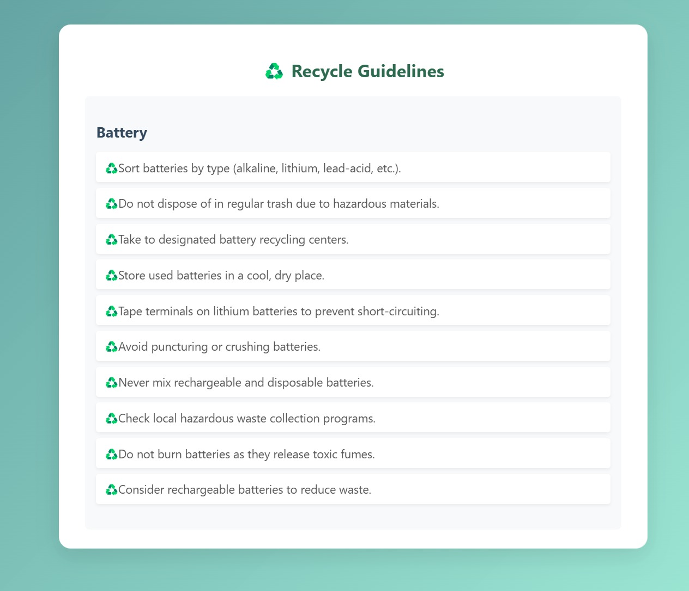
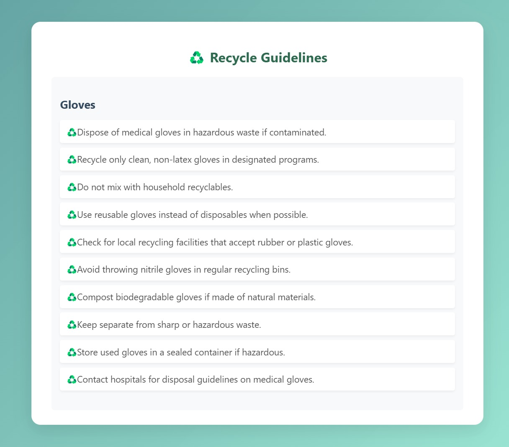
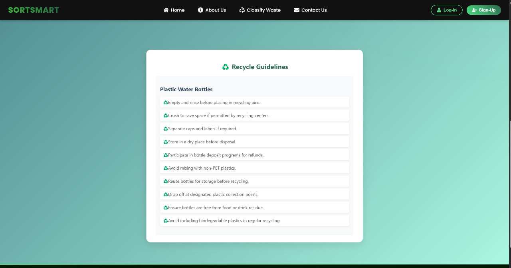
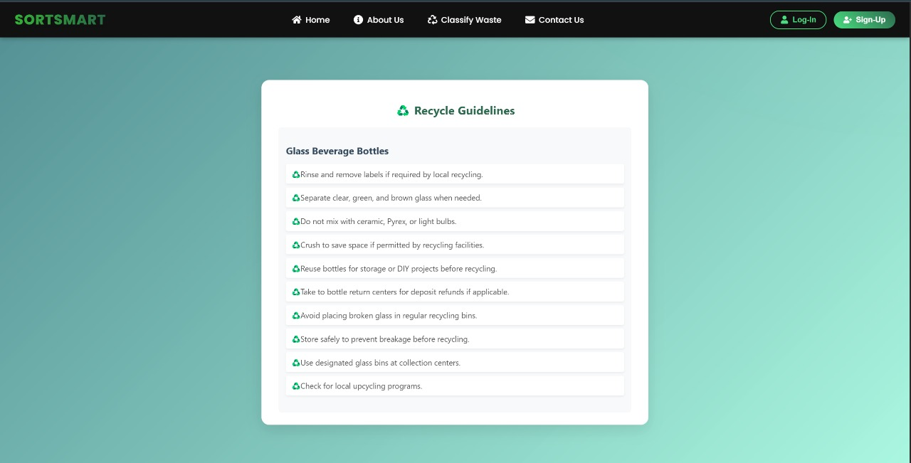

## ♻️ Overview

**Waste management is one of the most urgent environmental challenges of our time.**  
With global waste generation exceeding *2 billion tonnes annually* — and over **33% of it mismanaged** — improper disposal continues to harm ecosystems, public health, and urban sustainability. A major contributor to this issue is incorrect waste segregation at the source, where recyclables, organics, and hazardous materials are often mixed due to a lack of awareness or accessible tools.

While advanced waste classification systems using sensors, robotics, and automation exist, they are **prohibitively expensive**. These systems rely on technologies like spectrometers and AI-powered robotic arms, placing them out of reach for *small clinics, educational institutions, local businesses, and residential communities*.

---

**SORT SMART** bridges the accessibility gap by offering a cost-effective, image-based waste classification platform. Instead of requiring specialized hardware, users simply upload a photo of a waste item through a clean and responsive web interface. Behind the scenes, a trained **GoogLeNet (Inception)** deep learning model classifies the item into one of **52 predefined categories.**

Based on the prediction, the system provides *clear, category-specific recycling or disposal instructions* and can optionally suggest nearby disposal centers based on the user’s location.

---

### 👥 Who Is It For?

SORT SMART is designed for:
- 🧍‍♂️ Individuals and households  
- 🏢 Small businesses, offices, and retail stores  
- 🏥 Clinics and medical facilities  
- 🏫 Educational institutions  
- 🏛️ Municipal authorities and environmental organizations  

---

### 💡 Why It Matters

- Empowers users to **reduce their ecological footprint** without expensive infrastructure  
- Encourages **correct waste segregation at the source**, improving downstream recycling  
- Promotes **environmental awareness and education**  

---

## 🧠 Key Features

- 🔍 **AI-Powered Waste Classification**: Upload a photo and classify it into 1 of 52 predefined waste categories using a custom-trained GoogLeNet (Inception) model.  
- ♻️ **Recycling & Disposal Guidelines**: Real-time guidance pulled from structured JSON based on the classified category.  
- 📍 **Nearby Recycling Centers**: Location-based suggestions of disposal facilities using local datasets.  
- 💬 **Feedback System**: Users can report incorrect classifications to improve model accuracy over time.  
- 💻 **Responsive UI**: Clean, intuitive interface built using modern web frameworks.  
- 🔒 **Secure Access**: Firebase-backed authentication and secure API handling.  

---

## 🏗️ System Architecture

### **Frontend**
- Built using **React.js** and styled with **CSS Modules**
- Responsive design for desktops with scalability to mobile platforms

### **Backend**
- Developed in **Python** using **Flask**
- Hosts the ML model and processes image classification requests
- Exposes RESTful API endpoints for classification, guidelines, and location-based queries

### **Machine Learning**
- Final model: **GoogLeNet (Inception)**
- Trained on **52-category dataset**
- Preprocessing: resize, normalize (ImageNet), tensor conversion
- JSON-based mapping of waste category to disposal strategy

### **Data Management**
- `recycling_guidelines.json`: Categorized disposal instructions
- Excel feedback logs used for model improvement
---

## 🔬 Model Evaluation & Selection

Several models were evaluated to classify waste images, including:

- ✅ **GoogLeNet (Inception)** – *Final model selected for its 94.69% accuracy and strong generalization*
- ❌ **Xception** – Highest accuracy (99.58%) but suffered from overfitting
- ⚖️ **EfficientNet, DenseNet, ResNet, VGG** – Lower accuracy or added training complexity
- 🚫 **ViT, YOLO** – Underperformed due to dataset size or task misalignment

---

## 🔄 Data Flow

### **Image Classification**
1. User uploads image via frontend
2. Image sent to `/classify` endpoint
3. Backend processes the image
4. Model returns predicted class and confidence
5. Frontend displays classification and disposal guideline


### **User Feedback**
- Users report misclassified images
- Feedback stored in Excel for future retraining cycles

---

## 📡 API Endpoints

| Endpoint                     | Method | Functionality                                      |
|------------------------------|--------|----------------------------------------------------|
| `/test`                      | GET    | Check backend health                               |
| `/classify`                  | POST   | Accept image, return class & confidence            |
| `/guidelines/<class_name>`   | GET    | Return recycling instruction for specific category |
| `/all-guidelines`            | GET    | Return all categories & guidelines                 |
| `/recycling-centers`         | POST   | Return nearest centers based on user location      |

---

## 🛠️ Tech Stack

| Component         | Technology                                              |
|-------------------|---------------------------------------------------------|
| **Frontend**      | React.js, AngularJS, CSS, Framer Motion, Firebase Auth  |
| **Backend**       | Flask, PyTorch, torchvision, Flask-CORS, PIL            |
| **Model**         | GoogLeNet (Inception) – Trained on custom dataset       |
| **Storage & APIs**| JSON (guidelines), CSV (centers), Excel (feedback logs) |
| **Dev Tools**     | VS Code, Jupyter Notebook, GitHub, REST APIs            |

---

## 📦 Setup Instructions

### **Frontend**
```bash
cd client
npm install
npm start
```

### **Backend**
```bash
cd backend
pip install -r requirements.txt
python app.py
```

## 🎯 Future Enhancements

- 💰 **Reward System**: Introduce a point-based system redeemable with eco-friendly partner brands  
- 🧠 **Multi-item Detection**: Enable detection of multiple waste types in a single image
- 📷 **Live Camera Integration**: Allow real-time detection for clinics, public spaces, etc.  
- 🗺️ **Regional Policy Mapping**: Tailor disposal recommendations to local regulations  
- 🔄 **Automated Model Retraining**: Incorporate feedback to fine-tune model performance over time  
- 🌍 **Multilingual & Accessibility Support**: High-contrast mode, offline access, and voice instructions  
- 🚛 **Pickup Scheduling Integration**: Connect users to local waste management services for direct disposal  

---

## Output 















